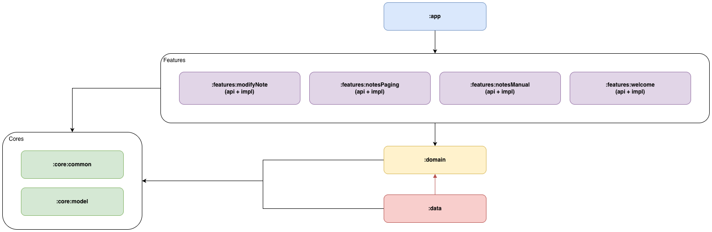

# Notation (Android)

A multi-module note-taking app built with **Jetpack Compose** and a **Clean Architecture**-inspired module layout.

## App Functions

- **Welcome**
  - Entry/landing feature module.

- **Notes (Manual pagination)**
  - Displays notes in a `LazyColumn`.
  - Implements **manual keyset pagination** backed by Room (`createdAt` cursor).
  - Supports **load more** when scrolling near the end.
  - Refreshes automatically when returning from Modify Note (via `ResultEventBus`).

- **Notes (Paging 3)**
  - A separate implementation of the notes list using **Paging 3** + Room `PagingSource`.

- **Modify Note**
  - Add / edit / delete a note.
  - On successful save/delete, emits an event to update the previous screen.

## Tech Stack & Libraries

### UI

- **Jetpack Compose (Material 3)**
  - UI toolkit for building screens.
  - Uses Compose BOM and `material-icons-extended`.

- **Navigation 3** (`androidx.navigation3`)
  - Navigation stack + `NavDisplay`.

- **Lifecycle / ViewModel (Compose)**
  - `collectAsStateWithLifecycle()` for state collection.

### Dependency Injection

- **Hilt**
  - DI across modules.
  - Codegen via **KSP**.

### Data

- **Room**
  - Local persistence for notes.

- **Paging 3**
  - For the paging-based notes list.

### Serialization

- **kotlinx.serialization**
  - JSON serialization for shared models where needed.

### Logging

- **Timber**
  - Logging API used across modules.

## Key Data Flows

### Updating Notes after Add/Edit/Delete

This project uses an event-based result mechanism:

- `ModifyNoteScreen` sends events via `LocalResultEventBus.current.sendResult(...)`.
- The notes list screen collects those events and triggers refresh.

Recommended event keys (current usage):

- `"NoteSaved"`
- `"NoteDeleted"`

## MVI (Feature `:impl` modules)

Feature implementation modules (`:features:*:impl`) follow a lightweight **MVI** style:

- **State**
  - A `ViewState` data class representing the UI state for a screen.
  - Exposed as `StateFlow<State>` from the ViewModel.
  - Collected in Compose via `collectAsStateWithLifecycle()`.

- **Action**
  - A `ViewAction` sealed type representing *user intents* (e.g. `Init`, `Refresh`, `LoadMore`, `Save`).
  - The UI sends actions to the ViewModel (e.g. `viewModel.sendAction(...)`).
  - The ViewModel handles actions and updates state.

- **Event**
  - A `ViewEvent` sealed type for one-off effects (e.g. navigation, snackbar, setting text fields).
  - Exposed as a flow and collected from the UI in a `LaunchedEffect`.

### Typical folder layout

- `view/`
  - Compose screen(s)
- `view/vm/`
  - `*VM` (extends `CommonVM`)
  - `*State`, `*Action`, `*Event`

### Base ViewModel

Screens commonly use `CommonVM` (`:core:common`) to standardize the pattern:

- `state: StateFlow<S>` for UI state
- `event: SharedFlow<E>` (or equivalent) for one-off effects
- `sendAction(action: A)` to send user intents into the ViewModel

## Module Structure

Modules are grouped by responsibility:

- `:app`
  - Application entry point (`NotationActivity`, `NotationApp`).

- `:core:model`
  - Core models shared across layers (e.g., `Note`).

- `:core:common`
  - Shared UI utilities, base ViewModel (`CommonVM`), navigation abstractions, result event bus, shared composables.

- `:domain`
  - Business interfaces (e.g., repositories). Contains only non-UI dependencies.

- `:data`
  - Room database, DAO, repository implementations, paging wiring.

- `:features:*`
  - Feature modules split into `api` (contracts) and `impl` (implementation).

Included feature modules (from `settings.gradle.kts`):

- `:features:welcome:{api,impl}`
- `:features:notesManual:{api,impl}`
- `:features:notesPaging:{api,impl}`
- `:features:modifyNote:{api,impl}`

## Module Relationship Diagram



## Build

- Assemble debug:

```bash
./gradlew :app:assembleDebug
```

## Notes

- Paging dependencies are split by layer:
  - **Domain**: paging-common
  - **Data**: paging-runtime + room-paging
  - **Feature UI**: paging-compose
